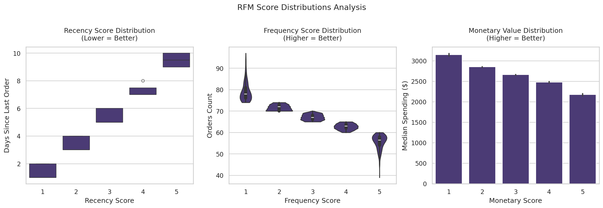
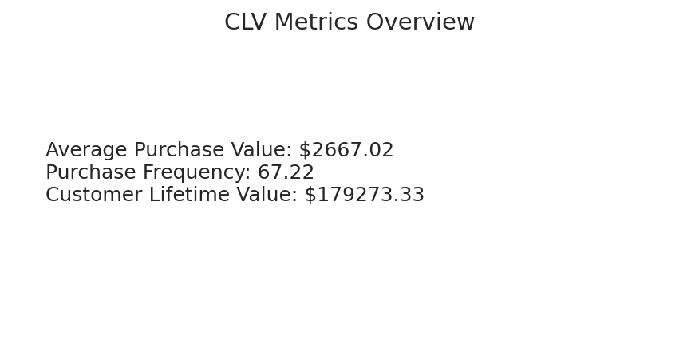

# Restaurant Sales Analysis

Welcome to the **Restaurant Sales Analysis** project! 
This project analyzes restaurant sales data over three months, aiming to identify high-level revenue trends, 
highlight top-selling items, and segment customers for targeted marketing initiatives.


## Repository Structure
```
restaurant_sales_analysis/
                     ├─ data/ 
                     │     ├─ guests.csv 
                     │     ├─ menu-data.csv 
                     │     ├─ orders_04_2022.csv
                     |     ├─ orders_05_2022.csv
                     |     ├─ orders_06_2022.csv 
                     ├─ notebooks/
                     |     ├─ 0_Environment_Setup.ipynb 
                     |     ├─ 1_Data_Cleaning.ipynb
                     |     ├─ 2_Exploratory_Analysis.ipynb
                     |     ├─ 3_Advanced_Metrics.ipynb 
                     |     └─ 4_Advanced_Analytics.ipynb 
                     ├─ visuals/
                     |     └─ (Visualizations PNG files) 
                     └─ README.md
```

## Tools & Technologies

List the primary languages, libraries, and platforms used:

**Python**
- Pandas, NumPy for data manipulation
- Matplotlib, Seaborn for visualization
- Google Colab as the development environment


## Project Goals

- **Data Cleaning & Integrity**: Ensure all references (client IDs, menu item IDs) are consistent.
- **Exploratory Analysis**: Uncover initial patterns of daily revenue, top items, daily/weekly sales trends and average order value(AOV).
- **Advanced Analytics**: Profit calculations by menu category and overal. Customer behavior such as RFM (Recency, Frequency, Monetary), cohort analysis and referral source.


## How to Use

1. **Clone or Fork** this repository.
2. **Open Notebooks** in Google Colab:
   - `0_Environment_Setup.ipynb` to install dependencies (`ipython-sql`, etc.).
   - Next notebooks for step-by-step analysis.
3. **Data Folder (`data/`)** contains the CSV files (guests, menu, orders).
4. **Visuals Folder (`visuals/`)** contains the PNG files as result of analysis.

## Data Cleaning and Preparation

Notebook: [1_Data_Cleaning.ipynb](notebooks/1_Data_Cleaning.ipynb)

This notebook focuses on:

1. **Data Integrity**  
   - Ensuring each `menu_item_id` from the orders matches entries in the menu dataset,  
   - Verifying `client_id` references are consistent with the guests table.

2. **Datetime Conversion**  
   - Converting `order_date` and `order_time` columns into proper datetime formats.

3. **Categorizing Time of Day**  
   - Splitting orders into `Morning`, `Lunch`, `Afternoon`, and `Evening` intervals based on the restaurant's hours (8:00 AM to 11:00 PM).

4. **Handling Missing Values and Duplicates**  
   - Checking for null entries and removing duplicates to ensure clean, consistent data.


## Saving and Uploading Cleaned Data

After performing data cleaning in `1_Data_Cleaning.ipynb`, we generated a new CSV file named `orders_cleaned.csv`. Because Google Colab doesn't automatically push CSV files to our GitHub repository, we manually upload the file to our `/data` folder:

1. Download the CSV from Colab:
   ```python
   from google.colab import files
   files.download("orders_cleaned.csv")


By the end of this cleaning phase, we have a reliable dataset ready for **Exploratory Data Analysis (EDA)**.

## Exploratory Analysis

Notebook: [2_Exploratory_Analysis.ipynb](notebooks/2_Exploratory_Analysis.ipynb)

This notebook includes:
- **Daily Revenue Trends**
- **Order Distribution by Time of Day**
- **Top-Selling Items** 
- **AOV (Average Order Value) Distribution**
- **Discount Analysis**
- **Heatmap (Day of Week × Time of Day)**

By exploring these aspects, we uncover operational patterns, highest-demand periods, and overall customer behavior, guiding informed business decisions.

- **Daily Revenue Trend**
  

- **Orders by Time of Day**
  

- **Top-Selling Items**
  

- **Average Order Value (AOV) Distribution**
  

- **Discount Usage Distribution**
  

- **Heatmap (Day of Week × Time of Day)**
  

### Advanced Metrics & Visualization

Notebook: [3_Advanced_Metrics.ipynb](notebooks/3_Advanced_Metrics.ipynb)

- Calculate advanced financial metrics:
  - **Overall Profit Margin**: Total profit divided by total sales
  - **Average Items per Order**: Total quantity of items divided by the number of unique orders
  - **Average Revenue per Guest**: Total sales divided by the number of unique guests

- **Visualizations**:
  - **Top 5 Categories by Profit**: Bar chart showcasing the most profitable categories
  - **Top 5 Items by Profit**: Bar chart highlighting the top-performing menu items
  - **Revenue by Referral Source**: Pie chart illustrating the distribution of revenue across different referral channels
  - **Key KPIs**: Textual summary of critical metrics

- **Advanced Metrics Overview**
  

###  Advanced Analytics

Notebook: [4_Advanced_Analytics.ipynb](notebooks/4_Advanced_Analytics.ipynb)

In this notebook, we perform **deeper customer-centric analyses** to gain further insights into the restaurant’s performance and identify strategies to improve customer retention, lifetime value, and overall profitability:

- **RFM Analysis**  
  - Segment customers based on **Recency**, **Frequency**, and **Monetary** metrics.  
  - Identify high-value customers and develop targeted marketing strategies.

- **RFM Segmentation**
  

- **Cohort Analysis**  
  - Examine **customer retention** over time by grouping users based on their first purchase month (cohort).  
  - Track and compare how different cohorts engage and remain active in subsequent months.

- **Customer Lifetime Value (CLV)**  
  - Estimate the total revenue a customer is expected to generate over their entire relationship with the restaurant.  
  - Understand how investing in customer acquisition and retention can yield higher returns.

- **Customer Lifetime Value (CLV)**
  

By incorporating these advanced analytical methods, the notebook reveals **patterns in customer loyalty**, **high-value segments**, and **long-term profitability drivers**, enabling the restaurant to make data-driven decisions that enhance both customer satisfaction and business performance.

---

###  Next Steps or Future Work

to extend the project:

Add predictive modeling or ARIMA for sales forecasting.
Deploy a Streamlit or Dash app for interactive data exploration.
Integrate RFM or Cohort analyses if not done.
To facilitate further **interactive visualizations** in Tableau, we export key outputs:
- **Export RFM Data** → `rfm_results.csv` (data/rfm_results.csv)  
- **Export Cohort Data** → `cohort_retention_tableau.csv` (data/cohort_retention_tableau.csv)  
- **Export CLV Data** → `clv.csv` (data/clv.csv)   
Expand dataset to include more months or additional features.


### Key Findings

**Basical Sales Analysis**
1. Daily Revenue Trend: Visualization of revenue by day over three months demonstrates an upward trend in sales (in dollars). Day-to-day fluctuations in revenue are not significant.
Time of Day:The chart shows that the lunch period (11:00–14:00) has the highest number of orders, followed by the evening and morning periods, with the afternoon period having the lowest order count. This indicates that lunch is the peak time for customer activity, while the afternoon sees a significant drop in orders.

2. Top-Selling Items: Chicken Nuggets (12 pcs) are the most popular item, followed by Fries (Small) and Spicy Chicken Wings (6 pcs). Milkshakes and salads also rank among the top items, reflecting a diverse customer preference for snacks and beverages.

3. AOV: The distribution of order totals shows that the majority of orders fall in the range of 
60, with a mean order total of $39.68. This suggests that customers tend to spend around this average amount per visit, indicating a balance between individual and group orders. Additionally, the long tail on the right side of the distribution highlights occasional high-value orders, likely influenced by larger group sizes or multiple items per order.

4. Discount Usage: The data shows that most customers do not use discounts. Orders without any discount make up the vast majority, while discounts of 5%, 10%, and 15% were used in only a small number of orders. This suggests that the discount program is not widely used by customers.

5. Heatmap (Day of Week vs Time of Day): The heatmap reveals that Wednesday and Sunday have the highest order volumes during lunch hours, making them peak days for sales. In contrast, mornings and afternoons across all days see significantly lower order counts.
**These insights guide management decisions for staffing, promotional timing, and menu optimization.**

**Key Insights about Profitability and Revenue Analysis**
1. Most Profitable Categories
Snacks lead in profitability, followed by Pizza and Beef Burgers, indicating that smaller items contribute significantly to revenue.
Milkshakes and Chicken Burgers generate the least profit among the top five, suggesting they may have lower margins or lower sales volume.

2. Top 5 Most Profitable Items
Spicy Chicken Wings (12 pcs) and Chicken Nuggets (12 pcs) are the highest-profit items, likely due to high demand and favorable pricing.
Meat Lovers Pizza and Double Cheeseburger also generate substantial profit, making them key menu items to promote.

3. Revenue by Referral Source
Social Media (30.9%) and Word of Mouth (28.8%) are the two most significant sources of customer acquisition, highlighting the importance of organic marketing strategies.
Google Maps (12.2%) and Advertisement (17.9%) still contribute to revenue but may require optimization for better returns.

4. Key KPIs
Overall Profit Margin: 59.4%, suggesting a strong balance between pricing and cost efficiency.
Average Items per Order: 4.52, indicating customers typically purchase multiple items per visit.
Average Revenue per Guest: $2,667.02, providing a clear benchmark for customer value.

**Actionable Recommendations**
Leverage Popular Items for Promotions: High-profit items like Spicy Chicken Wings and Chicken Nuggets should be featured in promotional campaigns.
Optimize Referral Channels: Given the impact of Social Media and Word of Mouth, the restaurant should further invest in engagement and referral programs.
Improve Lower-Performing Categories: Milkshakes and Chicken Burgers could benefit from pricing adjustments or bundling strategies to enhance profitability.
These insights help guide menu optimization, pricing strategies, and marketing focus for sustained business growth.


**Conclusions of customer behavior**
1. RFM Analysis
Recency (R Score): Customers with a lower recency score (1-2) have made purchases more recently, while those with a higher score (4-5) have not made a purchase in a longer time. This suggests a segment of inactive customers who may need re-engagement strategies.
Frequency (F Score): Customers with higher frequency scores have made fewer purchases, while those with lower scores have made significantly more transactions. This indicates a loyal customer base that makes frequent purchases.
Monetary (M Score): Customers with lower monetary scores have spent significantly more than those with higher scores, suggesting that high-value customers are concentrated in lower RFM segments.

2. Cohort Analysis
Retention Rates: The current cohort analysis shows a 100% retention rate across all months.
Note: The data was synthetically generated for demonstration purposes and does not reflect real-world customer behavior. In a real analysis, retention rates would typically decline over time due to customer churn.

3. Customer Lifetime Value (CLV)
Average Purchase Value: 2,667.02, indicating that customers tend to place high-value orders.
Purchase Frequency: 67.22 purchases per customer, which suggests that loyal customers return frequently.
Customer Lifetime Value (CLV): $179,273.33, meaning each customer contributes a significant amount in revenue over their lifetime. This high CLV suggests that the business benefits from strong customer retention and frequent repeat purchases.
**Actionable Recommendations**
Re-engage inactive customers: Offer targeted promotions to customers with high recency scores (4-5) to encourage repeat purchases.
Encourage repeat purchases: Develop loyalty programs to incentivize high-frequency customers to increase their order size.
Refine cohort analysis: Introduce churn factors into the retention model to better simulate real customer retention trends.
Leverage high CLV customers: Focus marketing efforts on retaining and upselling high-value customers who contribute the most to overall revenue.
By refining retention strategies and enhancing customer engagement, the business can sustain long-term profitability and maximize customer lifetime value.


## Contact
Author: Nariman Zingerov
Email: zingeroff@gmail.com
LinkedIn: www.linkedin.com/in/nariman-zingerov-a21a75270


Stay tuned for more updates and final insights!
